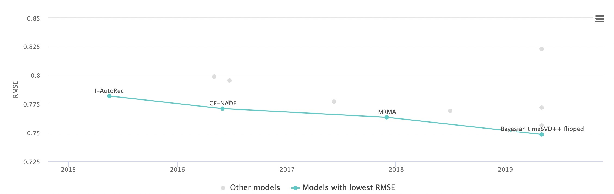

# 基于矩阵分解的推荐系统
### 2022本科生数据科学与工程算法基础实践作业（二）
---
## 一、背景
在信息化和大数据的时代，如何精准地挖掘出用户的偏好是一个老生常谈的问题。推荐系统是解决此类问题的一个研究主题。本次实践作业关于如何使用矩阵分解技术解决推荐问题。

### 问题定义
给定一个用户评分矩阵 $\mathbf{R}\in\mathbb{R}^{m\times n}$，其中$m$为用户（user）的数量，$n$为物品（item）的数量。矩阵元素$r_{ij}\in\mathbf{R}$表示用户$u_i$为物品$v_j$的评分值。任务目标有两个：
- 通过矩阵分解和凸优化技术，获得每个用户$u_i$和物品$v_j$的隐式向量，分别记作$\mathbf{u}_i\in\mathbb{R}^{k}$和$\mathbf{v}_i\in\mathbb{R}^{k}$，其中$k$为向量维度；所有用户和物品分别组成矩阵$\mathbf{P}\in\mathbb{R}^{m\times k}$和$\mathbf{Q}\in\mathbb{R}^{n\times k}$；
- 根据获得的用户和物品向量，预测该用户对某个物品的偏好程度$\hat{r}_{ij}=\mathbf{u}_i\mathbf{v}_i^{T}$；

因为在实际应用中，这个用户评分矩阵式稀疏的。例如某电影网站一共有100
k用户和10k部电影，有一些用户可能只看不超过10部电影，或者有些的电影可能被观影的人数很少。换句话说，这个用户评分矩阵存在大量的缺失值，因此通过矩阵分解可以先挖掘出已存在的用户行为，再预测这些缺失值。

## 二、作业要求

### 2.1 数据集
课程选取了电影评分数据集，包括约20k用户和10k物品。总共有超过240k评分数据。根据评分数据划分了训练集（237k评分数据）、验证集（10k评分数据）和测试集（50k评分数据）。
- 其中训练集和验证集中，每一条数据表示为$(u_i, v_j, r_{ij})$三元组；
- 测试集则用于评测，其只有用户和商品$(u_i, v_j)$，需要预测出他们的评分；
- 验证集和测试集中出现的所有用户和商品确保一定在训练集中存在，即不考虑冷启动问题；

```
训练集、验证集样例：
userId,movieId,rating
7795,4577,5.0
7795,2972,4.0
7795,319,5.0

测试集样例：
ID,userId,movieId
0,5973,32
1,18832,4085
```

### 2.2 任务目标
本次实践作业要求如下：

（1）实现矩阵分解推荐系统项目，包括数据读取、模型训练、优化算法、模型验证与测试；
- 实现随机梯度下降和批量梯度下降算法，完成$\mathbf{P}$和$\mathbf{Q}$矩阵的参数更新；
- 进一步优化算法，包括正则化、偏置项和协同过滤；
- 鼓励使用或自研其他算法技术来进一步提升矩阵分解的泛化性能；

（2）完成代码后，将训练好的模型，在测试集上进行预测，并提交至榜单：https://www.kaggle.com/competitions/dase-recsys/overview

（首次访问请点击：https://www.kaggle.com/t/4514cd6b970843979d7db5727a39fc8e ）
```
说明：
（1）我们提供的测试集没有标签，需要您对通过验证集对模型进行优化和改进。我们已经实现了在测试集上预测的过程，预测文件为submit_results.csv

ID,rating
0,3.512824296951294
1,3.512824296951294

（2）第二项作业作为加分项，旨在促进提升对模型训练的优化能力，激发学生分析问题，解决问题的能力。

（3）验证集和测试集的评价指标为RMSE；
```
目前在电影评论数据集上的RMSE效果进展如下图所示（取自于paperwithcode）：



（3）完成实验报告，报告内容要求：
- 对矩阵分解在推荐系统的应用背景介绍、个人理解等；
- 几种优化算法、以及改进算法的代码实现原理，以及对应的实验对比结果（即验证集和测试集的结果）；
- 探索矩阵分解算法的一些优势和缺点；
- 项目完成感悟和总结；


## 三、提交要求

以下为提交的必做作业，提交至邮箱：52245903002@stu.ecnu.edu.cn
- 实现的源代码（只限zip压缩包）；
- 实验报告（只限PDF版本）；

以下为可选作业（作为加分项目，鼓励大家完成，但不作为强求）
- 测试集的预测结果（提交到榜单上https://www.kaggle.com/competitions/dase-recsys/overview，注意实名）；

本次实践作业不允许相互抄袭；不允许使用验证集或测试集训练模型；不允许使用他人测试集预测的结果作为提交结果；数据集为公开数据，但不允许通过非模型训练手段完成预测。
